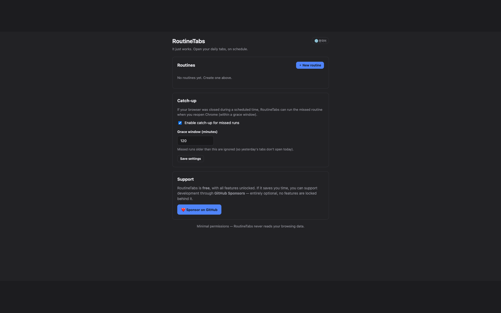
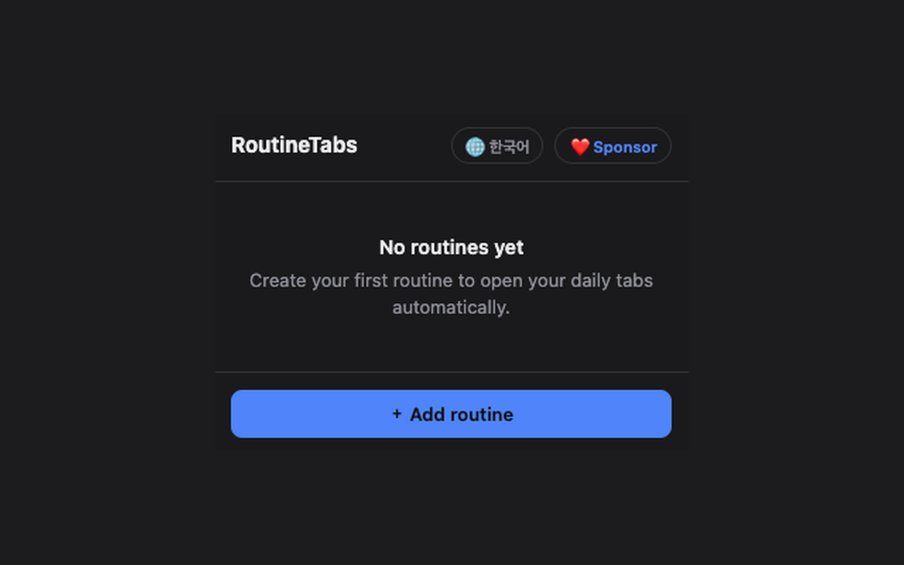
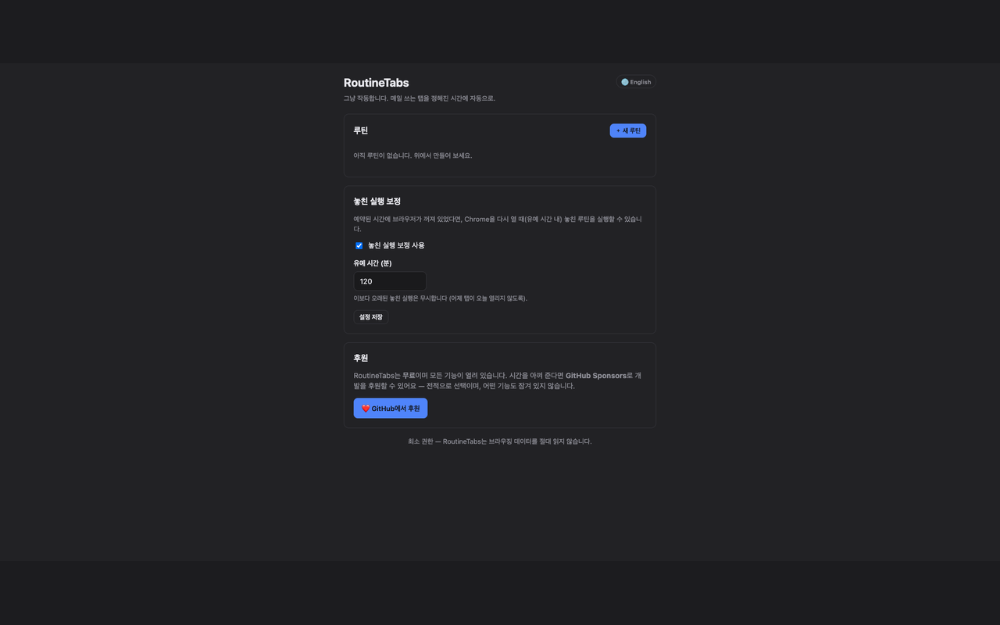

# RoutineTabs

> 매일 여는 탭 세트를 **요일·시간에 맞춰 자동으로** 열어주는 Chrome 확장 (Manifest V3).
> **서머타임(DST) 안전 · 끄면 진짜 꺼짐 · 완전 무료 · 최소 권한.**

[한국어](#한국어) · [English](#english)

<p align="center">
  
</p>

---

## 한국어

RoutineTabs는 매일 사용하는 웹사이트(메일·캘린더·대시보드·업무 도구)를 **당신이 정한 요일과 시간에 자동으로 열어주는** Chrome 확장 프로그램입니다. 새로운 기능 경쟁이 아니라 **"제대로, 안정적으로 동작하는 것"** 하나에 집중했습니다.

### 스크린샷

| 옵션 (영어) | 팝업 | 옵션 (한국어) |
|:---:|:---:|:---:|
|  |  |  |

### 주요 기능
- **루틴** = `{ 이름, URL 목록, 일정(요일 + 시간), 활성화 여부 }`.
- 정해진 **로컬 시간**에 탭 세트를 자동으로 엶 (새 탭 또는 새 창).
- **지금 실행** 버튼으로 즉시 실행.
- **끄면 진짜로 멈추는 토글** — 1위 경쟁 제품의 핵심 버그를 해결.
- **신뢰성 엔진**: DST 안전 스케줄링, 서비스 워커가 종료된 뒤 자동 복구, 브라우저가 꺼져 놓친 실행을 다시 따라잡기(catch-up).
- **완전 무료** — 모든 기능 잠금 없음. 후원은 선택적인 **[GitHub Sponsors](https://github.com/sponsors/zzaisang)** 링크로만(페이월 없음, 잠긴 기능 없음).
- 다크 모드, **영어 / 한국어 토글**, **`alarms` + `storage` 권한만 사용** (브라우징 데이터는 절대 읽지 않음).

### 설치 (개발자 모드로 직접 로드)
1. `npm install` → `npm run build` (`dist/` 생성).
2. 주소창에 `chrome://extensions` 입력.
3. 우측 상단 **개발자 모드** 켜기.
4. **압축해제된 확장 프로그램을 로드합니다** 클릭 → `dist/` 폴더 선택.
5. 툴바에 RoutineTabs 아이콘이 생기면 클릭해 팝업을 엽니다.

### 동작 방식
1. 옵션 페이지에서 **새 루틴** 생성: 이름·URL·요일·시간 입력.
2. 정해진 시간이 되면 그 탭 세트가 자동으로 열립니다.
3. 필요 없을 땐 토글로 끄고, 아무 때나 **지금 실행**으로 즉시 열 수 있습니다.

> **브라우저 재시작에 대한 솔직한 안내:** Chrome은 켜져 있을 때만 루틴을 실행할 수 있습니다. 예약 시간에 Chrome이 닫혀 있었다면, 다시 열 때 (직접 설정하는 유예 시간 내에서) 놓친 실행을 따라잡습니다.

### 수익화 모델 = 무료 + 후원
모든 기능은 무료이며 페이월이 없습니다. 후원은 외부 **GitHub Sponsors** 링크를 통해서만 받으며 앱 내 결제나 백엔드는 없습니다. 링크 핸들은 `github.com/sponsors/zzaisang`이고, 계정에서 Sponsors를 활성화하기 전까지는 404가 납니다.

### 개인정보
루틴과 설정은 브라우저의 `chrome.storage.local`에만 저장되어 **기기를 벗어나지 않습니다.** 추적·계정·서버가 없습니다. 자세한 내용은 [개인정보처리방침](./PRIVACY.md)을 참고하세요.

---

## English

A Chrome (Manifest V3) extension that opens a chosen set of URLs at the days/times
you pick — the way the category leader *should* have worked. The whole product is
about **execution quality**, not new features. See [`PLAN.md`](./PLAN.md) for the
full product/market rationale.

### What it does

- **Routines** = `{ name, URL list, schedule (days + time), enabled }`.
- Opens the tab set automatically at the scheduled local time (as new tabs or a new window).
- **"Run now"** button to fire a routine immediately.
- **Enable/disable toggle that truly stops a routine** (the #1 competitor's core bug).
- **Reliability engine**: DST-safe scheduling, recovery after the service worker is
  evicted, and catch-up for runs missed while the browser was closed.
- **Fully free** — all features unlocked. Optional **[GitHub Sponsors](https://github.com/sponsors/zzaisang)**
  link to support development (no paywall, nothing locked behind it).
- Dark mode, **English / Korean toggle**, **only `alarms` + `storage` permissions** (never reads your browsing data).

### Tech stack

- **TypeScript + Vite + [@crxjs/vite-plugin](https://crxjs.dev/)** (MV3 build + HMR).
- No UI framework (vanilla TS + CSS) for low maintenance.
- Donations via an external **GitHub Sponsors** link (no in-app payments, no backend).
- **Vitest** unit tests for the pure scheduling logic.

### Project layout

```
routinetabs/
├── PLAN.md                  # product spec & rationale
├── PRIVACY.md               # privacy policy (used as the Web Store policy URL)
├── manifest.config.ts       # MV3 manifest (permissions: alarms, storage only)
├── vite.config.ts           # Vite + crxjs + vitest config
├── docs/
│   ├── STORE_LISTING.md      # Chrome Web Store submission copy & checklist
│   └── screenshots/          # README screenshots
├── public/icons/            # 16/32/48/128 PNG placeholders (replace before launch)
├── src/
│   ├── background.ts         # service worker: alarms, firing, rehydration, catch-up
│   ├── lib/
│   │   ├── schedule.ts       # PURE functions: nextOccurrence / previousOccurrence / getMissedOccurrence
│   │   ├── alarms.ts         # self-rescheduling one-shot alarm helpers
│   │   ├── storage.ts        # chrome.storage.local wrapper + migration
│   │   ├── tabs.ts           # opening tabs / windows
│   │   ├── url.ts            # URL normalization + validation
│   │   ├── sponsor.ts        # GitHub Sponsors donation link
│   │   ├── i18n.ts           # English/Korean dictionary + runtime language toggle
│   │   ├── messaging.ts      # typed popup/options -> background messages
│   │   ├── format.ts         # display helpers (next-run, day labels)
│   │   └── types.ts          # data model
│   ├── popup/                # popup.html / .css / .ts
│   ├── options/              # options.html / .css / .ts
│   └── styles/theme.css      # shared tokens + dark mode
└── tests/schedule.test.ts    # DST / weekday / catch-up boundary tests
```

### Build & run

```bash
npm install
npm run build      # tsc --noEmit + vite build  -> dist/
npm test           # vitest: schedule engine unit tests
npm run dev        # vite dev server with HMR (for local development)
```

#### Load the unpacked extension in Chrome

1. Run `npm run build` (produces `dist/`).
2. Open `chrome://extensions`.
3. Enable **Developer mode** (top-right).
4. Click **Load unpacked** and select the `dist/` folder.
5. The RoutineTabs icon appears in the toolbar. Click it to open the popup.

> For live development, `npm run dev` + Load unpacked on `dist/` gives HMR via crxjs.

#### Quick manual test of scheduling

1. Open the options page → **New routine**.
2. Add a URL or two, select today's weekday, set the time **2 minutes from now**, Save.
3. Wait — the tabs should open at that minute. Then toggle the routine **off** and
   confirm it does **not** open at the next scheduled time.

### Reliability design (the whole point)

All implemented in `src/background.ts`, `src/lib/alarms.ts`, `src/lib/schedule.ts`:

- **No `setTimeout`/`setInterval`** in the service worker — only `chrome.alarms`.
  (Verified: the built SW chunk contains zero timers.)
- **Listeners registered synchronously at module top level** so an evicted worker
  can be woken with handlers already attached.
- **Self-rescheduling one-shot alarms** (not `periodInMinutes`): on every fire we
  recompute the next *local wall-clock* occurrence, so DST transitions never drift
  the "9:00 the user sees".
- **Re-read `enabled` from storage on every fire** before opening tabs — this is the
  toggle fix the competitor can't ship.
- **`onInstalled` / `onStartup` rehydration** rebuilds all alarms from storage.
- **Missed-run catch-up**: on startup we run occurrences missed while the browser was
  off, but only within a configurable grace window (default 120 min) and only if not
  already run.

### Monetization model (free + donations)

RoutineTabs is **fully free** — every feature is unlocked, no paywall. Donations are
optional via an external **GitHub Sponsors** link (no in-app payments, no backend,
no extra permissions). The link lives in `src/lib/sponsor.ts`:

1. Enable GitHub Sponsors for your account at <https://github.com/sponsors>
   (Korea payouts are supported via Stripe Connect / a fiscal host).
2. Confirm the handle in `SPONSOR_URL` (currently `github.com/sponsors/zzaisang`).
   The link 404s until Sponsors is active on the account.
3. The popup header and the options "Support" section open this URL via
   `chrome.tabs.create` — no permission needed.

> Chrome Web Store allows external donation links as long as they're transparent and
> payment isn't processed inside the extension — which is exactly this setup.

### Remaining TODO (user action required)

| # | Task | Why it can't be done here |
|---|------|---------------------------|
| 1 | **Enable GitHub Sponsors** and confirm `SPONSOR_URL` in `src/lib/sponsor.ts` | Requires your account; set up at <https://github.com/sponsors>. |
| 2 | **Replace placeholder icons** in `public/icons/` (16/32/48/128) with real artwork | Auto-generated clock placeholders are functional but plain. Regenerate or drop in your own PNGs of the same names/sizes. |
| 3 | **Chrome Web Store developer registration ($5 one-time)** and store submission | Paid, manual, account-bound. See [`docs/STORE_LISTING.md`](./docs/STORE_LISTING.md). |
| 4 | **Confirm the name "RoutineTabs"** is free of store/trademark conflicts | Manual check; have 1–2 backup names ready. |
| 5 | Manual integration QA from `PLAN.md §10` (browser-restart catch-up, multi-routine, etc.) | Requires loading in a real Chrome. |

#### Regenerating the placeholder icons

The icons were generated by a small dependency-free Node script (a blue rounded
square + white clock face). To recreate or tweak them, re-run the PNG generation
snippet from the project history, or simply overwrite the four files in
`public/icons/` with your own PNGs named `icon16.png`, `icon32.png`, `icon48.png`,
`icon128.png`.

---

## License / status

`v1.0.0` — solo project. See [`PLAN.md`](./PLAN.md) for scope and roadmap (auto-close,
tab groups, sync, import/export are explicitly **out of scope** for the MVP).
